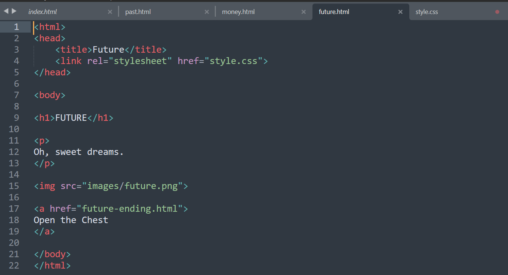
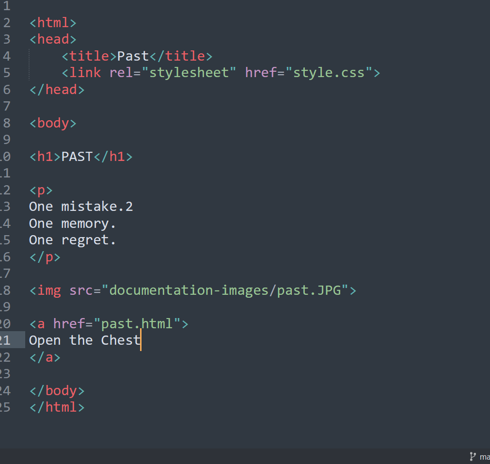
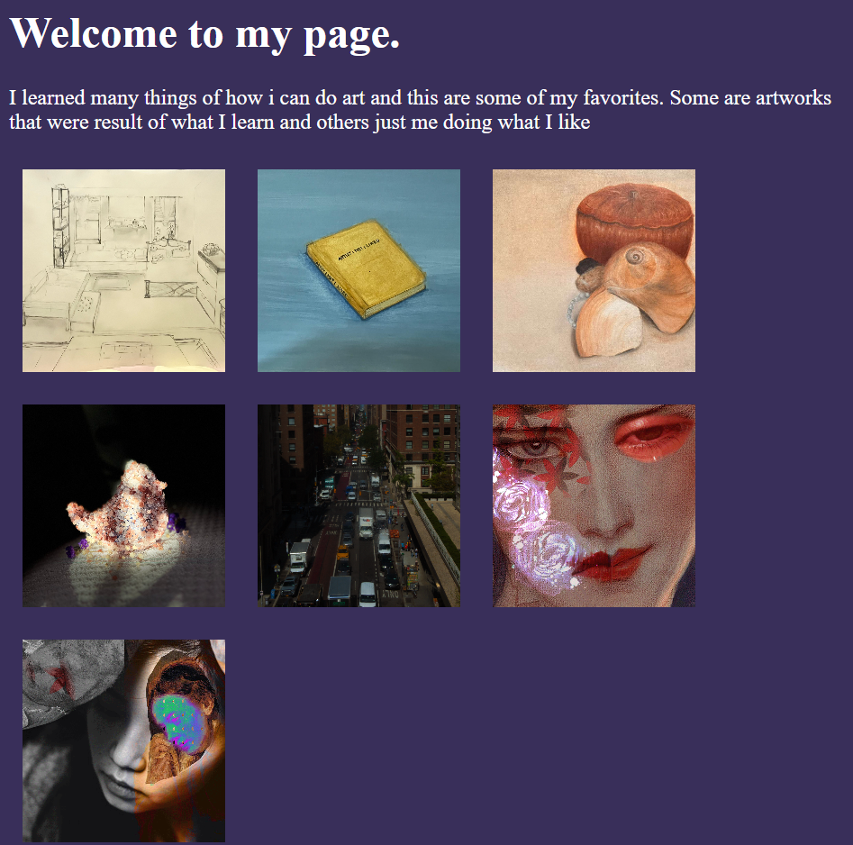

# My Process 

Originally, I was going to do an interactive story. I wasn't even halfway through and it was being so annoying and exhausting. At the last minute, I changed my idea to exposing it like a gallery, but also like a journal of my art. I still needed to do many pages, but it was much easier and made me more comfortable with what I learned in class.

I think I made everything just as I learned in class. What I learned was how to put an image as a background. I changed the colors many times because I didn't like them at first, but at the end, I achieved something that I liked. Also, I was looking every minute at our class notes and screenshots.

Also, I was confused if the order would affect the looks, especially in my style.css page. Well, it wasn't the case. I was also confused with the order in the index, so I went through the notes and also got AI help.

---

## Code I Used

### For the programming, I made the index.html site where I would display the gallery. I then made the style.css, where I could place the background that I made, along with defining the style that each of the sites would follow for consistency.

## Technical Issues I Ran Into

### 1. Structural Order Confusion
I was confused about whether the order of my selectors would affect the visual look, especially inside my style.css page and the index.html. I went through our class notes and screenshots to make sure the structural placement was right, and noticed that keeping things clean let the design work correctly.

### 2. Live Page Image Loading Errors
When I checked my live GitHub Pages website, the images were not showing up at all even though they worked on my desktop. I tried watching video tutorials, but they just made me more confused. To fix it, I first audited everything I did to find the mistake myself. When I couldn't find it, I asked the AI what was wrong and how to fix it, which helped me figure out how to clean up the paths.

### 3. Background Image Setup
I wanted to use my "back.jpg" asset as a background instead of a flat color. I had to look closely at my notes to make sure I used the correct `url()` syntax on the body selector, along with `background-size: cover` and `background-attachment: fixed` so it spreads across the screen cleanly.

---

## Some Elements I Used

- **Heading tags:** `<h1>` for the main portfolio title element.
- **Paragraph tag:** `
` for the text description block.
- **Image tag:** `` to render the custom drawings inside the frame.
- **Link tag:** `<a>` to create navigation branches between my main wall and art pages.

---

# Showing Process

