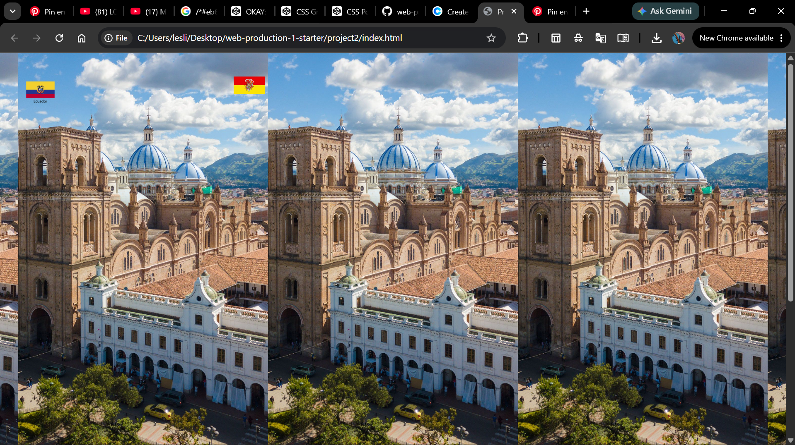
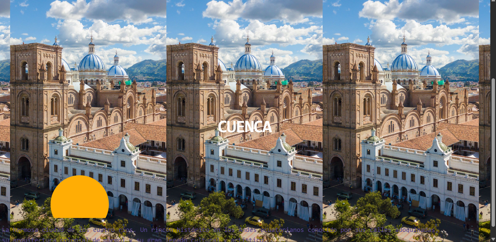
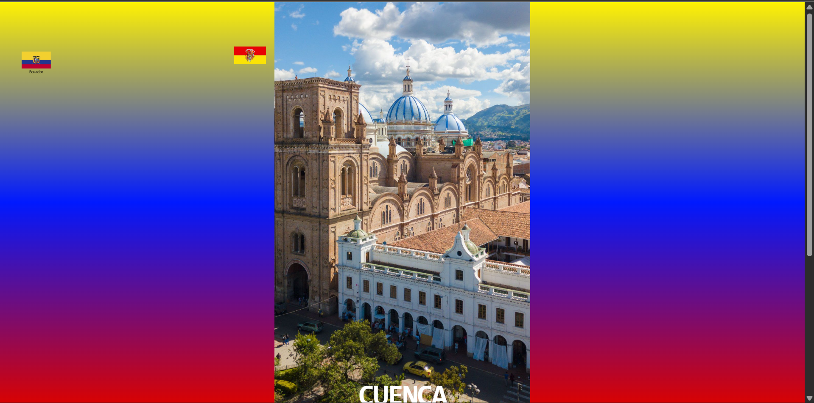
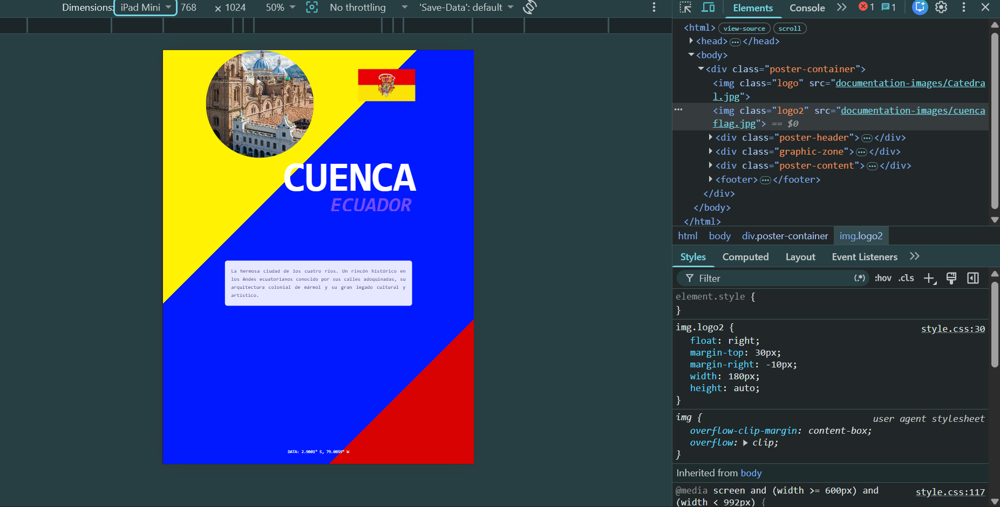
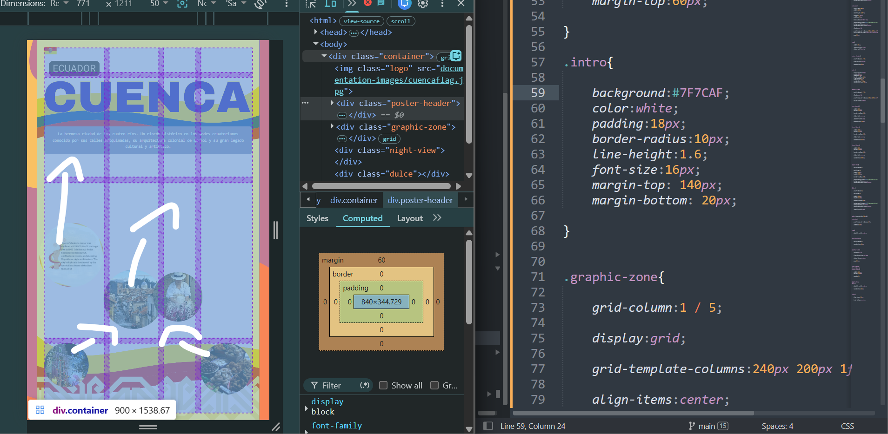

/*#daf7dc *#EB6424* naranja #FA9500 naranja amarillento #3F88C5 celeste1 #724CF9 azul1 #564592 azul marino #564592 amarillo pasteloso #FFAD05 amarillo naranjoso #FFF202 amarillo #0019FF azul #D80202 rojo*/

# Project 2: My Web Poster 

## 1. About the Place I Grew Up
At first, I was really unsure about how to represent the place where I grew up. My neighborhoog it's calle Monaychico. I didnt know ho to represented, at the end i decide to show whole Cuenca a small city but really  beautiful. Why? because it's small and with my grandma we went to everywhere. Also she has many friends around.

Growing up there, I was always surrounded by its amazing colonial architecture and the gorgeous nature that wraps around the entire place. 

The local festivities were always incredible, full of so much joy and delicious food. My absolute favorite one has always been *Corpus Christi*. This poster is also very personal to me because my grandmother was a traditional *cholita cuencana* from head to toe, with her beautiful clothing. It was very common for me to see my neighbors dressed just like my grandma, with their beautiful two braids and their *sombreros de paja toquilla* (Panama hats). I wanted to capture all those warm childhood memories in this project.

---

## 2. My Design & Inspiration
* **The Look:** I wanted a clean but cool collage effect using geometric shapes and overlapping circles, taking notes from classic Swiss Poster Design.
* **The Files:** I designed a custom background plate (`atras.png`) with the colors of the flag and curved layouts, and then placed my photos on top to tell the story of my hometown.
* **The Fonts:** I used a monospace font face with tight line-spacing to give it that retro book-cover or music poster vibe we saw in class.

---

## 3. My Coding Journey (The Struggles & Triumphs)
I used a lot of our class notes for this assignment. To be honest, writing the `index.html` file was pretty easy, but I started struggling a lot with the `style.css`. Trying to make a poster work by just writing lines of commands almost drove me completely crazy. 

I got so frustrated at the beginning because I couldn't make the screen look like the actual sketch I had designed. Every time I changed one single thing, the pictures would fly everywhere or they wouldn't move at all. Then, when I tried writing the media queries, they did absolutely nothing. I had to pause, do some actual research, and read our class notes all over again to finally understand how width, height, and boundaries change when you move things around. 

Of course, I got some AI support during the process, but honestly, it wasn't helpful at all at the beginning. It only started making sense once I actually understood what I was typing into Sublime Text myself. I made a ton of mistakes and repeated things over and over because I didn't want to just copy and paste or rely on AI. It was a stressful process, but at the end, I managed to create something very close to what I envisioned in my head.

---

## 4. How the Code Actually Works (The Technical Part)

To make sure the poster stays stable and completely responsive on both my computer screen and my iPad without breaking, this is how the structure is set up:

### A. The Grid System (`display: grid`)
Instead of hardcoding positions, the main layout uses a 4-column CSS Grid based on our class requirements:
```css
.container {
    width: 100%;
    max-width: 900px;
    display: grid;
    grid-template-columns: 1fr 1fr 1fr 1fr;
    grid-template-rows: auto auto auto auto;
    gap: 20px;
}
```
Large text boxes and the main header use `grid-column: 1 / 5;` so they stretch completely across the poster instead of getting squished into small boxes.

### B. Moving the Circles Freely (`position: absolute`)
To stop the pictures from fighting each other and jumping around, we detached the `.graphic-zone` from the regular block layout:
```css
.graphic-zone {
    grid-column: 1 / 5;
    position: absolute;
    width: 100%;
    height: 100%;
    top: 0;
    left: 0;
}
```
By turning this zone into an absolute sheet, I can place each circle (`.sun-element`, `.river-line-1`, `.river-line-2`) in its exact spot on top of the background image without pushing the rest of my texts or messing up the layout.

### C. Fixing the Frozen Scroll Box (`z-index`)
I wanted the historical description block (`.intro`) to have its own vertical scroll track so it stays neat:
```css
.intro {
    grid-column: 1 / 5;
    grid-row: 3 / 4;
    overflow-y: scroll;
    overflow-x: hidden;
    position: relative;
    z-index: 10;
}
```
Setting `overflow-y: scroll` turns on the scrolling behavior inside that box. Since the absolute graphic layer was covering the text and locking my mouse clics, adding `position: relative; z-index: 10;` pulls the text box to the very front so the scroll wheel handles perfectly.

At first, I dont know. I just assume that the media was going to be the same as it was in class but after looking for more i realize that putting all the instructions inside would help my poster to be able to fit in small screens. I think i add much that what i need to, but i feel comfortable with it.

Also i didn't know that `aspect-ratio:1/1` was able to keep the shape of my circular images.









